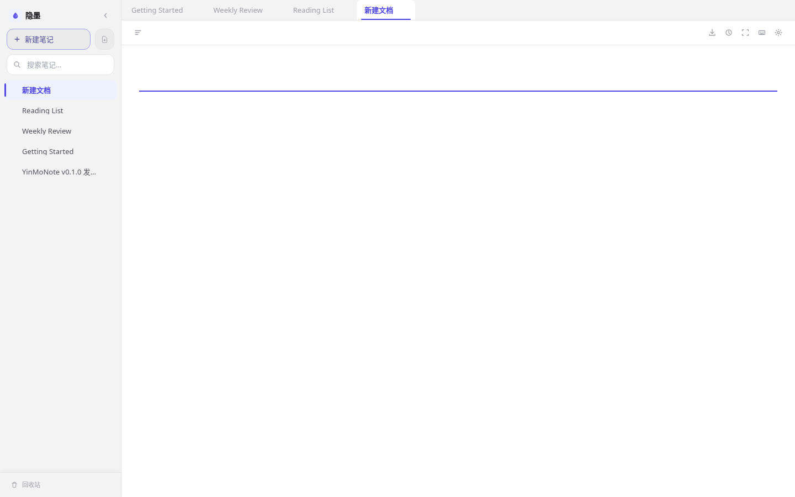

# YinMoNote

[中文版](./README.zh.md) | English

[](./LICENSE)


YinMoNote is a **browser-based document note application** that aims to deliver the writing experience of Feishu Docs — real-time rich-text editing, nested documents, version history, and one-click sharing — entirely on your own server with full data ownership. Every element renders live as you type; there is no mode-switching between editing and preview.



> All code and documentation in this project were generated by [Claude Code](https://claude.ai/code) and [Gemini](https://gemini.google.com/).

## Markdown Support

The editor is built on [Tiptap](https://tiptap.dev/) and renders every element in real time:

| Category | Syntax |
|---|---|
| Headings | H1 – H6 |
| Inline | Bold, italic, strikethrough, underline, inline code, highlight, superscript, subscript |
| Blocks | Blockquote, ordered / unordered / task lists, horizontal rule |
| Code | Fenced code blocks with syntax highlighting (Go, Python, TypeScript, SQL, YAML, Rust, …) |
| Math | KaTeX — block math and inline math (`$E=mc^2$`) |
| Diagrams | Mermaid (flowchart, sequence, class, …) with dark-mode awareness |
| Rich blocks | Callout (info / warning / tip / danger), Toggle (collapsible section) |
| Tables | Full table editing with row/column operations, resizable columns, Feishu-style row/col selector bars, mobile long-press menu |
| Media | Image upload with viewport lazy loading |

Smart Markdown paste: paste raw Markdown text and it is parsed and rendered immediately without manual conversion.

Slash commands (`/`) insert any block element without leaving the keyboard. A bubble formatting menu appears on selection for quick inline styling.

## Features

- **Version history**: Built-in Git engine with idle-aware auto-commit. Browse history, compare versions with inline diff (character-level highlights), and roll back with one click.
- **Command palette** (`Cmd+K` / `Ctrl+K`): Quick note search and command execution — type `>` for commands (new note, settings, lock, theme, trash).
- **Theme**: Auto / Light / Dark tri-state — follows system preference by default via `prefers-color-scheme`, or manually override in Settings.
- **Export**: Export any note as `.md`, styled HTML, or PDF. Batch import from files, folders, or ZIP.
- **Full-text search**: Debounced title and content search across the entire note library.
- **Multi-tab editing**: VS Code-style preview / pinned tabs with drag-and-drop reordering.
- **Sidebar**: Drag-and-drop tree, nested folders, tag filter, virtual scroll for large libraries.
- **Cross-tab sync**: Edits in one browser tab are reflected in others via BroadcastChannel.
- **Mobile**: Scrollable format toolbar pinned above the keyboard, responsive layout.
- **WebDAV**: Connect Obsidian, iA Writer, or any WebDAV client to `/dav/`.
- **AI access (MCP)**: Embedded [Model Context Protocol](https://modelcontextprotocol.io/) server — let Claude or other AI assistants read and write your notes with fine-grained access rules.
- **End-to-end encryption**: AES-256-GCM with PBKDF2 (100k iterations) or hardware-key derivation via WebAuthn PRF. Server-side enforcement rejects unencrypted notes when enabled.
- **Accessibility**: Full keyboard navigation with visible focus rings, ARIA-compliant command palette and toggle switches, `prefers-reduced-motion` support.

## Quick Start

### Docker (recommended)

```bash
make docker           # build Docker image → dist/yinmonote-<version>-docker-<arch>.tar
make install-docker   # build + interactive install (data dir, port, access mode)
```

`make install-docker` includes the build step and loads the `.tar` image into Docker. After installation the container starts automatically.

### Native Binary — macOS

```bash
make build       # compile → dist/yinmonote-darwin-arm64
make install     # interactive: data dir + port + LaunchAgent
```

Or download the `.dmg` from the release page and double-click `Install.command`.

### Native Binary — Linux

```bash
make build       # compile → dist/yinmonote-linux-amd64
make install     # interactive: data dir + port + systemd service
```

For TLS, cross-compilation, `.deb` packaging, and all other build options, see [build/README.md](build/README.md).

### Native Binary — Windows

1. Download `yinmonote-<version>-windows-amd64.zip` from the release page.
2. Extract the ZIP.
3. Double-click **Install.bat** (or right-click `Install.ps1` → *Run with PowerShell*).
4. Follow the prompts — choose Task Scheduler (no admin) or Windows Service (admin).
5. Open the URL shown at the end of installation and set a password on first launch.

**Defaults**: notes stored in `%USERPROFILE%\.yinmonote\notes\` (Task Scheduler) or
`C:\ProgramData\YinMoNote\notes\` (Windows Service).

For self-signed HTTPS, download and trust the CA cert once per device (`/ca.crt`).

## WebDAV

Connect Obsidian Remotely Save, iA Writer, or any WebDAV client to sync notes as readable Markdown files.

| Setting | Value |
|---|---|
| Server URL | `https://<host>:7281/dav/` |
| Username | `yinmonote` |
| Password | WebDAV token — generate once in **Settings → Security → WebDAV token** |

**Token setup**: open Settings → Security, click **Generate** under "WebDAV Token", copy the token (shown once only), paste it as the password in your WebDAV client.

**Remote Base Directory**: any vault name is accepted. The server strips the leading directory segment and maps all paths to the note root — you do not need to match the server directory to your vault name.

**File names**: WebDAV clients see human-readable note titles (e.g. `My Note.md`) rather than internal random IDs.

**Server-side encryption**: when serverEncrypt is enabled, notes on disk are stored as `ENC1:` ciphertext that third-party WebDAV apps cannot read. Disable serverEncrypt before using WebDAV clients.

> **Keyless mode**: if no password has been set on the server, WebDAV access is open and unauthenticated.

## AI Access (MCP)

Enable in **Settings → AI Access**, generate a token, then add the endpoint to your AI client config:

```json
{
  "mcpServers": {
    "yinmonote": {
      "url": "https://<your-server>/mcp/sse",
      "headers": { "Authorization": "Bearer <your-token>" }
    }
  }
}
```

Access rules can restrict by tag, note ID, title glob, or subtree.

## Project Structure

```
build/      Dockerfile, Compose, build/install scripts  → build/README.md
docs/       Architecture docs
tests/      Unit + E2E test suites                       → tests/README.md
backend/    Go source code
frontend/   Vue 3 source code
```

## License

[MIT](./LICENSE) — Copyright (c) 2026 YinMoNote Contributors

The source code and documentation in this repository were generated with the assistance of AI tools (Claude Code and Gemini). The copyright holder directed the design, architecture, and prompting of these AI systems.

## Disclaimer

YinMoNote is provided **"as is"** without warranty of any kind. The authors and contributors are not responsible for any data loss, corruption, or other damages arising from the use of this software. **You are solely responsible for backing up your data.** Please maintain regular backups of your notes directory and verify that backups are restorable before relying on them.
